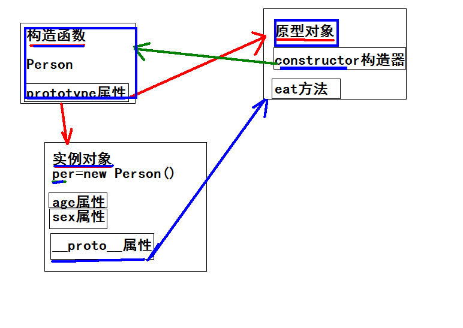

@[TOC](目录)

# 


# JavaScript基础


## 构造函数和实例对象和原型对象三者之间的关系以及原型链

构造函数可以实例化对象
构造函数中有一个属性叫prototype,是构造函数的原型对象
构造函数的原型对象(prototype)中有一个constructor构造器,这个构造器指向的就是自己所在的原型对象所在的构造函数
实例对象的原型对象(\_\_proto\_\_)指向的是该构造函数的原型对象
构造函数的原型对象(prototype)中的方法是可以被实例对象直接访问的


**原型链**：是一种关系，实例对象和原型对象之间的一种关系，关系是通过实例对象的原型(\_\_proto\_\_)属性来联系的



## 实例对象使用属性和方法层层的搜索顺序

当构造函数和原型对象具有同名的属性和方法名时，实例对象获取到的将是在构造函数中的值，因为实例对象使用的属性或者方法时,会先在实例中查找,找到了则直接返回使用,找不到则,去实例对象的\_\_proto\_\_指向的原型对象prototype中找,找到了则返回使用,找不到则报错


## 通过自调用函数如何把局部变量变成全局变量

1. 给window对象添加一个变量

(function(win){

​	var ele = "localEle";

​	win.ele = ele;

})(window)

2. 给egret添加一个变量

(function(ele){

​	var movieClip = "m";

​	ele.movieClip = movieClip;

})(egret)


## 获取窗口顶端到页面顶端的距离

          function getScrollOffsets(){
              var w = window;
              // lt IE9
              if(w.pageXOffset!=null)     return {x:w.pageXOffset, y:w.pageYOffset};
              var d = w.document;
              if(d.compatMode == "CSS1Compat")    return {x:d.documentElement.scrollLeft, y:d.documentElement.scrollTop};
              return {x:d.body.scrollLeft, y:d.body.scrollTop};
          }
## 获取某个元素相对于视口顶端的距离

​          document.getElementById("id").getBoundingClientRect();// 返回top,left,bottom,right


# DOM


## DOM元素的style属性

obj.style获取的是DOM元素CSS样式的声明对象简值。obj.style可读可写，所以我们会发现这样一个问题，当我们在JS代码中没有写obj.style之前去读obj.style也就是上面所发生的情况，会弹出一个空值，style只能获取到内联样式的具体值，而内部和外部样式无法获取到具体值。所以如果要获取CSS对象属性值，请使用currentStyle(IE Opera)和getComputedStyle(FF Chrome),但是currentStyle和getComputedStyle是只读的，所以修改CSS样式还是要用style来修改。

function getStyle(obj,attr) {
    window.getComputedStyle ? getComputedStyle(obj,null)[attr] : obj.currentStyle[attr];//(IE Opera)
}


## 元素VS节点

元素：等同于标签，文档下的有几个标签就有几个元素。

节点：页面中所有的内容，包括标签、属性（在标签里面的一个属性，如<input type="radio">中的type="radio"）和文本（文字，换行，空格，回车）。

节点的属性:(可以使用标签--元素.出来,可以使用属性节点.出来,文本节点.点出来)

- nodeType:节点的类型:1----标签,2---属性,3---文本
- nodeName:节点的名字:标签节点---大写的标签名字,属性节点---小写的属性名字,文本节点----#text
- nodeValue:节点的值:标签节点---null,属性节点---属性值,文本节点---文本内容

综合概括即元素是节点的一种类型


## * 元素各系列宽高和偏移值对比


| VS                                                           |      |
| ------------------------------------------------------------ | ---- |
| top：相对定位元素的上部偏移<br />left：相对定位元素的左部偏移<br />width：盒子模式下的宽度（边框间隙边缘包括与否取决于盒子模式）<br />height：盒子模式下的宽度（边框间隙边缘包括与否取决于盒子模式） |      |
| offsetTop：父级的**margin-top外边缘到自身边界border-top**的外边缘宽度（没脱离文档流时等于父级的margin-top,padding-top,boder-top加上自身的margin-top的宽度；脱离文档流时等于自身top值加上自身margin-top的值）<br />offsetLeft：父级的margin-left外边缘到自身边界border-left的外边缘宽度（没脱离文档流时等于父级的margin-left,padding-left,boder-left加上自身的margin-left的宽度；脱离文档流时等于自身left值加上自身margin-left的值）<br />offsetWidth：元素内容+左右padding的宽+左右border<br />offsetHeight：元素内容+上下padding的高+上下border |      |
| scrollTop：元素内容向上**卷曲出去的距离**<br />scrollLeft：元素内容向左卷曲出去的距离<br />scrollWidth：元素中内容的**实际的宽**（包括被滚动条卷曲的内容，>=元素自身的宽），如果没有内容就是元素的宽<br />scrollHeight：元素中内容的实际的高（包括被滚动条卷曲的内容，>=元素自身的高）,如果没有内容就是元素的高 |      |
| clientTop：上边**边框**的宽度<br />clientLeft：左边边框的宽度<br />clientWidth：元素内容+上下padding的宽<br />clientHeight：元素内容+上下padding的高 |      |


# JQuery


## 基本概念

### 版本区别

1.x版本兼容IE678

2.x版本及以上不兼容IE678

目前只更新3.x版本


### 入口函数

* 写法

```
//写法1
$(document).ready(function () {
  console.log("这是jQuery入口函数的第一种写法");
});
//写法2
$(function () {
  console.log("这是jQuery入口函数的第二种写法");
});
```

* 与js入口函数window.onload的区别：

1. js的入口函数执行要比jQuery的入口函数执行得晚一些。

2. jq的入口函数会等待页面的加载完成才执行，但是不会等待图片的加载。

3. js的入口函数会等待页面加载完成，并且等待图片加载完成才开始执行。

   

### jq对象与DOM对象的区别

jq对象其实就是js对象的一个集合，伪数组，里面存放了一大堆的DOM对象，所以jq对象抽出一个DOM对象就能调用DOM对象的方法，而DOM对象不能调用jq对象的方法，但DOM对象可以通过$(DOM对象)方法转换为jq对象


### 选择器

#### 基本选择器

| 名称       | 用法               | 描述                                 |
| ---------- | ------------------ | :----------------------------------- |
| ID选择器   | $(“#id”);          | 获取指定ID的元素                     |
| 类选择器   | $(“.class”);       | 获取同一类class的元素                |
| 标签选择器 | $(“div”);          | 获取同一类标签的所有元素             |
| 并集选择器 | $(“div,p,li”);     | 使用逗号分隔，只要符合条件之一就可。 |
| 交集选择器 | $(“div.redClass”); | 获取class为redClass的div元素         |

> 总结：跟css的选择器用法一模一样。


#### 层级选择器

| 名称       | 用法        | 描述                                                        |
| ---------- | ----------- | :---------------------------------------------------------- |
| 子代选择器 | $(“ul>li”); | 使用>号，获取儿子层级的元素，注意，并不会获取孙子层级的元素 |
| 后代选择器 | $(“ul li”); | 使用空格，代表后代选择器，获取ul下的所有li元素，包括孙子等  |


> 跟CSS的选择器一模一样。

#### 过滤选择器

> 这类选择器都带冒号:

| 名称         | 用法                               | 描述                                                        |
| ------------ | ---------------------------------- | :---------------------------------------------------------- |
| :eq（index） | $(“li:eq(2)”).css(“color”, ”red”); | 获取到的li元素中，选择索引号为2的元素，索引号index从0开始。 |
| :odd         | $(“li:odd”).css(“color”, ”red”);   | 获取到的li元素中，选择索引号为奇数的元素                    |
| :even        | $(“li:even”).css(“color”, ”red”);  | 获取到的li元素中，选择索引号为偶数的元素                    |

【案例：隔行变色】

#### 筛选选择器(方法)

> 筛选选择器的功能与过滤选择器有点类似，但是用法不一样，筛选选择器主要是方法。

| 名称               | 用法                        | 描述                             |
| ------------------ | --------------------------- | :------------------------------- |
| children(selector) | $(“ul”).children(“li”)      | 相当于$(“ul>li”)，子类选择器     |
| find(selector)     | $(“ul”).find(“li”);         | 相当于$(“ul li”),后代选择器      |
| siblings(selector) | $(“#first”).siblings(“li”); | 查找兄弟节点，不包括自己本身。   |
| parent()           | $(“#first”).parent();       | 查找父亲                         |
| eq(index)          | $(“li”).eq(2);              | 相当于$(“li:eq(2)”),index从0开始 |
| next()             | $(“li”).next()              | 找下一个兄弟                     |
| prev()             | $(“li”).prev()              | 找上一次兄弟                     |


