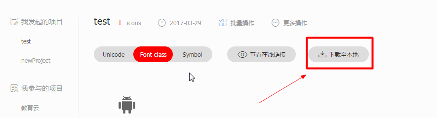

@[TOC](目录)


# CSS3

## 变形功能 transform
特效：旋转，缩放，倾斜，偏移
```css
.c1{transform:rotate(30deg);}
.c1{transform:scale(0.5);}
.c1{transform:rotate(30deg,30deg);}
.c1{transform:translate(30px,30px);}
```
基准点
transfom-origin(x,y) //参数值可以为具体像素值、百分比和left/top/right/bottom/center等关键字值

## 动画功能 transition animation
匀速渐变动画 transition 
写法： transition： property duration timing-function delay, property-2 duration-2 timing-function-2 delay-2, ...;
示例(c1的color属性在非hover状态切换到hover状态时会显示从red到yellow的动画，然后从hover状态到非hover状态时又会显示从yellow到red的动画)：

```css
c1{
	color : red;
    transition : color 0.5s linear;
    -webkit-transition : color 0.5s linear;
}
.c1 :hover{color:yellow}
```
## 关键帧动画 animation 
- 写法： animation: name duration timing-function delay iteration-count direction fill-mode play-state;
   示例(播放完mycolor帧动画后div的属性又恢复到了正常状态中)，timing-function的可选值 : linear|ease|ease-in|ease-out|ease-in-out|cubic-bezier(n,n,n,n);

```css
div {
     background:red;
     color: black;
     animation : mycolor 1s ease;
     -webkit-animation : mycolor 1s ease;
 }
 @-webkit-keyframes mycolor {
     0%{background:green; color:green;}
     50%{background:yellow; color:yellow;}
     100%{background:blue; color:blue;}
 }
 @keyframes mycolor {
     0%{background:green}
     50%{background:yellow}
     100%{background:blue}
 }
```


​         

## 服务端字体 @font-face
```css
 示例：
 @font-face {
     font-family : myFont,// 定义名称，提供给需要使用该字体的元素引用
     src : local("Sans"), // 加入属性local()是为了如果本地安装了该字体的话则不在请求服务端字体文件，该属性可以省略
     src:
     url(../fonts/MiFie-Web-Font.svg) format('svg'),
     url(../fonts/MiFie-Web-Font.eot) format('embedded-opentype'),
     url(../fonts/MiFie-Web-Font.ttf) format('truetype'),
     url(../fonts/MiFie-Web-Font.woff) format('woff');
     font-weight : bold;// 其它属性的自定义设置
 }
 h1{
     font-family : myFont;// h1使用该字体
     font-size : 80px;
 }
```


# CSS Hack


## 条件级Hack


```
<!--[if <keywords>? IE <version>?]>
HTML代码块
<![endif]-->
```
keywords

if条件共包含6种选择方式：是否、大于、大于或等于、小于、小于或等于、非指定版本

是否：指定是否IE或IE某个版本。关键字：空

大于：选择大于指定版本的IE版本。关键字：gt（greater than）

大于或等于：选择大于或等于指定版本的IE版本。关键字：gte（greater than or equal）

小于：选择小于指定版本的IE版本。关键字：lt（less than）

小于或等于：选择小于或等于指定版本的IE版本。关键字：lte（less than or equal）

非指定版本：选择除指定版本外的所有IE版本。关键字：!

version

目前的常用IE版本为6.0及以上，推荐酌情忽略低版本，把精力花在为使用高级浏览器的用户提供更好的体验上

IE10及以上版本已将条件注释特性移除，使用时需注意。

示例如下：

```
	只在IE下生效
	<!--[if IE]>
	这段文字只在IE浏览器显示
	<![endif]-->
	
	只在IE6下生效
	<!--[if IE 6]>
	这段文字只在IE6浏览器显示
	<![endif]-->
	
	只在IE6以上版本生效
	<!--[if gte IE 6]>
	这段文字只在IE6以上(包括)版本IE浏览器显示
	<![endif]-->
	
	只在IE8上不生效
	<!--[if ! IE 8]>
	这段文字在非IE8浏览器显示
	<![endif]-->
	
	非IE浏览器生效
	<!--[if !IE]>
	这段文字只在非IE浏览器显示
	<![endif]-->
```


## 属性级Hack

语法：
selector{<hack>?property:value<hack>?;}

取值：

\-：选择IE6及以下。连接线（中划线）（-）亦可使用，为了避免与某些带中划线的属性混淆，所以使用下划线（_）更为合适。

\*：选择IE7及以下。诸如：（+）与（#）之类的均可使用，不过业界对（*）的认知度更高

\9：选择IE6+

\0：选择IE8+和Opera15以下的浏览器

举个例子：

```
.hack{
/*demo1 注意顺序，否则IE6/7下可能无法正确显示，导致结果显示为白色背景*/  
    background-color:red; /* All browsers */  
    background-color:blue !important;/* All browsers but IE6 */  
    *background-color:black; /* IE6, IE7 */  
    +background-color:yellow;/* IE6, IE7*/  
    background-color:gray\9; /* IE6, IE7, IE8, IE9, IE10 */  
    background-color:purple\0; /* IE8, IE9, IE10 */  
    background-color:orange\9\0;/*IE9, IE10*/  
    _background-color:green; /* Only works in IE6 */  
    *+background-color:pink; /*  WARNING: Only works in IE7 ? Is it right? */  
}  
```


## 选择符级Hack

语法：
<hack> selector{ sRules }
说明：

选择不同的浏览器及版本

尽可能减少对CSS Hack的使用。Hack有风险，使用需谨慎

通常如未作特别说明，本文档所有的代码和示例的默认运行环境都为标准模式。

一些CSS Hack由于浏览器存在交叉认识，所以需要通过层层覆盖的方式来实现对不同浏览器进行Hack的。

目前最常见的是

```
*html *前缀只对IE6生效
*+html *+前缀只对IE7生效
@media screen\9{...}只对IE6/7生效
@media \0screen {body { background: red; }}只对IE8有效
@media \0screen\,screen\9{body { background: blue; }}只对IE6/7/8有效
@media screen\0 {body { background: green; }} 只对IE8/9/10有效
@media screen and (min-width:0\0) {body { background: gray; }} 只对IE9/10有效
@media screen and (-ms-high-contrast: active), (-ms-high-contrast: none) {body { background: orange; }} 只对IE10有效
等等
```

简单列举几个：

* html .test { color: #090; }       /* For IE6 and earlier */
* + html .test { color: #ff0; }     /* For IE7 */
.test:lang(zh-cmn-Hans) { color: #f00; }  /* For IE8+ and not IE */
.test:nth-child(1) { color: #0ff; } /* For IE9+ and not IE */


# CSS兼容性及其解决方案


透明度


## 定位属性设置成固定


# web字体图标

## 字体格式

不同浏览器所支持的字体格式是不一样的，我们有必要了解一下有关字体格式的知识。

1、TureType(.ttf)格式

.ttf字体是Windows和Mac的最常见的字体，是一种RAW格式，支持这种字体的浏览器有IE9+、Firefox3.5+、Chrome4+、Safari3+、Opera10+、iOS Mobile、Safari4.2+；

2、OpenType(.otf)格式

.otf字体被认为是一种原始的字体格式，其内置在TureType的基础上，支持这种字体的浏览器有Firefox3.5+、Chrome4.0+、Safari3.1+、Opera10.0+、iOS Mobile、Safari4.2+；

3、Web Open Font Format(.woff)格式

woff字体是Web字体中最佳格式，他是一个开放的TrueType/OpenType的压缩版本，同时也支持元数据包的分离，支持这种字体的浏览器有IE9+、Firefox3.5+、Chrome6+、Safari3.6+、Opera11.1+；

4、Embedded Open Type(.eot)格式

.eot字体是IE专用字体，可以从TrueType创建此格式字体，支持这种字体的浏览器有IE4+；

5、SVG(.svg)格式

.svg字体是基于SVG字体渲染的一种格式，支持这种字体的浏览器有Chrome4+、Safari3.1+、Opera10.0+、iOS Mobile Safari3.2+；

了解了上面的知识后，我们就需要为不同的浏览器准备不同格式的字体，通常我们会通过字体生成工具帮我们生成各种格式的字体，因此无需过于在意字体格式间的区别差异。

## 字体图标优点

图片是有诸多优点的，但是缺点很明显，比如图片不但增加了总文件的大小，还增加了很多额外的"http请求"，这都会大大降低网页的性能的。更重要的是图片不能很好的进行“缩放”，因为图片放大和缩小会失真。 我们后面会学习移动端响应式，很多情况下希望我们的图标是可以缩放的。此时，一个非常重要的技术出现了，额不是出现了，是以前就有，是被从新"宠幸"啦。。 这就是字体图标（iconfont).

```
可以做出跟图片一样可以做的事情,改变透明度、旋转度，等..
但是本质其实是文字，可以很随意的改变颜色、产生阴影、透明效果等等...
本身体积更小，但携带的信息并没有削减。
几乎支持所有的浏览器
移动端设备必备良药...
```

## @ - 字体图标制作使用维护流程

总体来说，字体图标按照如下流程：


### 设计字体图标

假如图标是我们公司单独设计，那就需要第一步了，这个属于UI设计人员的工作， 他们在 illustrator 或 Sketch 这类矢量图形软件里创建 icon图标， 比如下图：


  之后保存为svg格式，然后给我们前端人员就好了。 

  其实第一步，我们不需要关心，只需要给我们这些图标就可以了，如果图标是大众的，网上本来就有的，可以直接跳过第一步，进入第三步。

### 上传生成字体包

   当UI设计人员给我们svg文件的时候，我们需要转换成我们页面能使用的字体文件， 而且需要生成的是兼容性的适合各个浏览器的。

​    推荐网站： http://icomoon.io

**icomoon字库**

IcoMoon成立于2011年，推出的第一个自定义图标字体生成器，它允许用户选择他们所需要的图标，使它们成一字型。 内容种类繁多，非常全面，唯一的遗憾是国外服务器，打开网速较慢。

   推荐网站： http://www.iconfont.cn/

**阿里icon font字库**

http://www.iconfont.cn/

这个是阿里妈妈M2UX的一个icon font字体图标字库，包含了淘宝图标库和阿里妈妈图标库。可以使用AI制作图标上传生成。 一个字，免费，免费！！

**fontello**

[http://fontello.com/](http://fontello.com/)

在线定制你自己的icon font字体图标字库，也可以直接从GitHub下载整个图标集，该项目也是开源的。

**Font-Awesome**

[http://fortawesome.github.io/Font-Awesome/](http://fortawesome.github.io/Font-Awesome/)

这是我最喜欢的字库之一了，更新比较快。目前已经有369个图标了。

**Glyphicon Halflings**

[http://glyphicons.com/](http://glyphicons.com/)

这个字体图标可以在Bootstrap下免费使用。自带了200多个图标。

**Icons8**

[https://icons8.com/](https://icons8.com/)

提供PNG免费下载，像素大能到500PX


### 下载兼容字体包

刚才上传完毕， 网站会给我们把UI做的svg图片转换为我们的字体格式， 然后下载下来就好了

当然，我们不需要自己专门的图标，是想网上找几个图标使用，以上2步可以直接省略了， 直接到刚才的网站上找喜欢的下载使用吧。





### @ - 字体引入到HTML

得到压缩包之后，最后一步，是最重要的一步了， 就是字体文件已经有了，我们需要引入到我们页面中。

首先把 以下4个文件放入到 fonts文件夹里面。 通俗的做法


```html
<style>
/*自定义字体图标使用教程*/
    
/*1.通过@font-face定义自己的字体*/
@font-face {
    /*2.申明自己的字体名称*/
    font-family: 'wjs';
    /*3.引入字体文件（约束某一段字符代码什么图案）*/
    src:
    url(../fonts/MiFie-Web-Font.svg) format('svg'),
    url(../fonts/MiFie-Web-Font.eot) format('embedded-opentype'),
    url(../fonts/MiFie-Web-Font.ttf) format('truetype'),
    url(../fonts/MiFie-Web-Font.woff) format('woff');
}
/*4.怎么使用维护性更好*/
.wjs_icon{
    font-family: wjs;
}
.wjs_icon_phone::before{
    content: "\e908";
}
.wjs_icon_arrow::before{
    content: "\e909";
}
</style>

<!-- 使用字体 -->
<span class="wjs_icon wjs_icon_phone"></span>
```


### 追加新图标到原来库里面

如果工作中，原来的字体图标不够用了，我们需要添加新的字体图标，但是原来的不能删除，继续使用，此时我们需要这样做

把压缩包里面的selection.json 从新上传，然后，选中自己想要新的图标，从新下载压缩包，替换原来文件即可。


